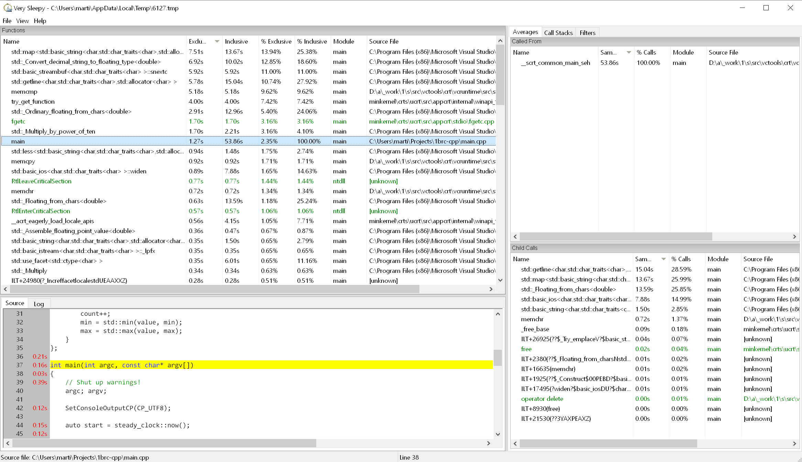

<!-- _class: lead -->

# The One Billion Row Challenge

---
<!-- _footer: https://github.com/gunnarmorling/1brc -->

# One Billion Row Challenge (1BRC)
- Fun challenge to optimize processing a huge text file
- Easy to make a naive solution, but with many opportunities for optimization
- Originally a Java challenge, but I used C++
- No focus on writing good, maintainable code, just to have fun and make it as fast as possible
- I intentionally did not look up others' solutions online

---

# The challenge
Process one billion rows of text (~13 GB) as fast as possible.
Each row contains one temperature measurement from a weather station with the format `<station name>;<measurement>`.

Example:
```
Hamburg;12.0
Bulawayo;8.9
Palembang;38.8
St. John's;15.2
Cracow;12.6
Bridgetown;26.9
Istanbul;6.2
```

---

# The challenge
- Output the min, mean and max temperature for each station, sorted alphabetically by station name
- Output format: `{Abha=-23.0/18.0/59.2, Abidjan=-16.2/26.0/67.3, Abéché=-10.0/29.4/69.0, ...}`

### Constraints
- Each measurement has exactly one fractional digit
- The station name can be at most 100 bytes long

---

# First implementation
```c++
// Struct keeping track of the values for each station
struct Station {
    double sum = 0;
    uint64_t count = 0;
    double min = std::numeric_limits<double>::max();
    double max = std::numeric_limits<double>::lowest();

    void update(double value) {
        sum += value;
        count++;
        min = std::min(value, min);
        max = std::max(value, max);
    }
};
```

---
<!-- _footer: "Starting point: ~260 seconds" -->

```c++
    std::map<std::string, Station> stations;
    std::ifstream fs("measurements.txt", std::ios::binary);

    for (std::string line; std::getline(fs, line);) {
        size_t delim_pos = line.find(';');
        std::string_view name(line.data(), delim_pos);
        std::string_view value(line.data() + delim_pos + 1);

        double v;
        std::from_chars(value.data(), value.data() + value.size(), v);

        stations[std::string(name)].update(v);
    }

    std::cout << '{';
    const char* delim = "";
    for (const auto& [name, station] : stations) {
        std::cout << std::format("{}{}={:.1f}/{:.1f}/{:.1f}",
            delim, name, station.min, station.sum / station.count, station.max);
        delim = ", ";
    }
    std::cout << "}\n";
```

<!-- std::from_chars from C++17, fast way to parse string to float (no locale, no allocations/exceptions, ...) -->

---

# Where to start?
- `std::ifstream` and `std::getline()`?
- Lots of lookups in `std::map`
- What about `std::from_chars()`?
- Are there unnecessary copies or allocations?
- Parallelization?
- Let's see what the profiler says!

---



<!--
https://github.com/VerySleepy/verysleepy
Open source sampling profiler
-->

---

# File reading
Can we do something to improve this?

We have plenty of RAM. What if we just load the entire file into memory?

---
<!-- _footer: "Entire file in RAM, state machine parsing: ~160 seconds" -->

```c++
    FILE* f = nullptr;
    fopen_s(&f, "measurements.txt", "rb");
    fseek(f, 0, SEEK_END);
    long long size = _ftelli64(f);
    char* data = new char[size];
    rewind(f);
    fread(data, sizeof(char), size, f);

    enum class ReadState { NAME, TEMPERATURE };
    ReadState state = ReadState::NAME;
    std::string name_buffer, value_buffer;
    for (long long i = 0; i < size; ++i) {
        switch (state) {
        case ReadState::NAME: {
            if (data[i] == ';') {
                state = ReadState::TEMPERATURE;
                continue;
            }
            name_buffer += data[i];
            break;
        }
        case ReadState::TEMPERATURE: {
            if (data[i] == '\n') {
                double v;
                std::from_chars(value_buffer.data(), value_buffer.data() + value_buffer.size(), v);

                stations[name_buffer].update(v);

                name_buffer.clear(); value_buffer.clear(); state = ReadState::NAME;
                continue;
            }
            value_buffer += data[i];
            break;
        }
        }
    }
```

---

# Next: float parsing
Looks like the float parsing is a good candidate to tackle next.

We know that all the measurements follow a specific format (exactly one fractional digit) => we don't need general float parsing.

Can we make a faster parser than `std::from_chars()` for this specific problem?

<!-- There are libraries for fast float parsing, but I wanted to avoid dependencies -->

---
<!-- _footer: "Custom float parsing: ~100 seconds" -->

```c++
static double parse_number(std::string_view str) {
    if (str.empty()) {
        return 0; // whatever for the purposes of this project
    }

    int sign = 1;
    if (str[0] == '-') {
        sign = -1;
        str.remove_prefix(1);
    }

    int64_t integer = 0;
    int64_t decimal = 0;
    bool seen_dot = false;

    for (char c : str) {
        if (c == '.') {
            seen_dot = true;
            continue;
        }

        if (!seen_dot) {
            integer = integer * 10 + (c - '0');
        } else {
            decimal = c - '0';
            break;
        }
    }

    return sign * (integer + decimal / 10.0);
}
```

---

# Map types
We are still using `std::map` ($O(log\ n)$ lookup). But often, `std::unordered_map` ($O(1)$ lookup) is faster.

By just changing the type of the map (and sorting the output at the end), we are now down to ~64 seconds.

---

# Coming back to old code
Turns out the code I wrote a year ago was not great.

- I initially forgot to sort the output alphabetically (woops)
- Line parsing can be done without string concatenations (potential allocations)

---
<!-- _footer: "Simplified line parsing: ~57 seconds" -->

```c++
    std::unordered_map<std::string, Station> stations;

    size_t line_start = 0;
    for (long long i = 0; i < size; ++i) {
        if (data[i] == '\n') {
            std::string_view line(data + line_start, i - line_start);

            size_t delim_pos = line.find(';');
            std::string_view name(line.data(), delim_pos);
            std::string_view value(line.data() + delim_pos + 1, i - line_start - delim_pos - 1);

            double v = parse_number(value);
            stations[std::string(name)].update(v);

            line_start = i + 1;
        }
    }
```

<!-- Heterogeneous lookup in C++23 should remove the need for std::string() in operator[] -->

---

# Parallelization
We could parallelize this pretty easily.

Approach: split the file into chunks (whole rows) and let a thread work on each chunk.
Then merge the partial results into a final map at the end.

<!-- No need for any mutex or synchronization -->

---

```c++
std::unordered_map<std::string, Station> process_chunk(const char* data, size_t start, size_t end) {
    std::unordered_map<std::string, Station> result;
    size_t line_start = start;
    for (size_t i = start; i < end; ++i) {
        if (data[i] == '\n') {
            std::string_view line(data + line_start, i - line_start);

            size_t delim_pos = line.find(';');
            std::string_view name(line.data(), delim_pos);
            std::string_view value(line.data() + delim_pos + 1, i - line_start - delim_pos - 1);

            double v = parse_number(value);
            result[std::string(name)].update(v);

            line_start = i + 1;
        }
    }

    return result;
}
```

---

```c++
// Struct keeping track of the values for each station
struct Station {
    double sum = 0;
    uint64_t count = 0;
    double min = std::numeric_limits<double>::max();
    double max = std::numeric_limits<double>::lowest();

    // ...

    void merge(const Station& other) {
        sum += other.sum;
        count += other.count;
        min = std::min(min, other.min);
        max = std::max(max, other.max);
    }
};
```

---
<!-- _footer: "Parallelization: ~13 seconds" -->

```c++
    const unsigned num_threads = std::thread::hardware_concurrency();

    // Find chunk boundaries by splitting the data by whole rows
    std::vector<size_t> chunk_starts(num_threads + 1);
    chunk_starts[0] = 0;
    for (unsigned i = 1; i < num_threads; ++i) {
        // Find the approximate position
        size_t start_pos = size * i / num_threads;

        // Advance to next line break
        while (start_pos < size && data[start_pos] != '\n') {
            ++start_pos;
        }
        chunk_starts[i] = start_pos + 1; // One pos past the '\n'
    }
    chunk_starts[num_threads] = size;

    // Process each chunk in its own thread
    std::vector<std::thread> threads;
    std::vector<std::unordered_map<std::string, Station>> partial_results(num_threads);
    for (unsigned i = 0; i < num_threads; ++i) {
        threads.emplace_back([&, i]() {
            partial_results[i] = process_chunk(data, chunk_starts[i], chunk_starts[i + 1]);
        });
    }
    for (auto& t : threads) {
        t.join();
    }

    // Merge the results into one final map
    std::unordered_map<std::string, Station> stations;
    for (const auto& partial : partial_results) {
        for (const auto& [name, station] : partial) {
            stations[name].merge(station);
        }
    }
```

---

# Memory-mapped file
We currently read the entire file into memory (~6 seconds) before starting the threads, causing a bottleneck.

We can instead create a memory-mapped view of the file, giving us a pointer that maps directly to the underlying file.

This way, each thread can read its part of the file efficiently (leaving paging to the OS).

---
<!-- _footer: "Memory-mapped file: ~8 seconds" -->

```c++
    HANDLE hfile = CreateFileA("measurements.txt", GENERIC_READ, 0, nullptr,
                               OPEN_EXISTING, FILE_ATTRIBUTE_NORMAL, nullptr);
    if (hfile == INVALID_HANDLE_VALUE) {
        std::cerr << "Failed to open file\n";
        return 1;
    }
    HANDLE hmap = CreateFileMappingA(hfile, nullptr, PAGE_READONLY, 0, 0, nullptr);
    if (!hmap) {
        std::cerr << "Failed to create file mapping\n";
        CloseHandle(hfile);
        return 1;
    }
    const char* data = static_cast<const char*>(MapViewOfFile(hmap, FILE_MAP_READ, 0, 0, 0));
    if (!data) {
        std::cerr << "Failed to create file view\n";
        CloseHandle(hmap);
        CloseHandle(hfile);
        return 1;
    }

    // Process data as before...

    UnmapViewOfFile(data);
    CloseHandle(hmap);
    CloseHandle(hfile);
```

---

# Next steps
- At this point, a big part of the processing time goes to hashing strings for `std::unordered_map`
- All measurements can be stored as `int`s and divided by 10 at the end
- In the line parsing, there is an unnecessary `line.find(';')`
- Probably more potential improvements

---

# Conclusion
<!-- _footer: "https://github.com/m-lundberg/1brc-cpp" -->

We went from 260 seconds to under 8 seconds.

This is where I stop (for now)!
